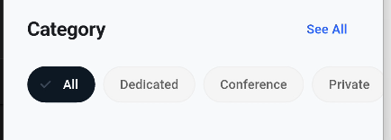

# Category Selector (Chips) Widget

A reusable, scrollable list of choice chips for category selection. This component delegates the state management (which chip is currently selected) to the parent view, ensuring a clean separation of UI and business logic.

## 🖼️ Visual Reference


*(Note: Ensure you have your placeholder or actual preview image saved at this path)*

## 💻 Implementation

### `category_selector.dart`

```dart
import 'package:flutter/material.dart';
import 'package:flutter_screenutil/flutter_screenutil.dart';

// Adjust these imports to match your project's architecture
import 'package:your_app/core/theme/app_colors.dart';
import 'package:your_app/core/theme/app_spacing.dart';
import 'package:your_app/core/theme/font_manager.dart';

class CategorySelector extends StatelessWidget {
  final List<String> categories;
  final int selectedIndex;
  final ValueChanged<int> onSelected;

  const CategorySelector({
    super.key,
    required this.categories,
    required this.selectedIndex,
    required this.onSelected,
  });

  @override
  Widget build(BuildContext context) {
    // Automatically detect the current theme mode to handle text/border colors dynamically
    final isDark = Theme.of(context).brightness == Brightness.dark;

    return SizedBox(
      height: 40.h,
      child: ListView.builder(
        scrollDirection: Axis.horizontal,
        padding: EdgeInsets.symmetric(horizontal: 24.w),
        itemCount: categories.length,
        itemBuilder: (context, index) {
          final isSelected = selectedIndex == index;
          
          return Padding(
            padding: EdgeInsets.only(right: 8.w),
            child: ChoiceChip(
              label: Text(
                categories[index],
                style: FontManager.bodyText().copyWith(
                  color: isSelected
                      ? AppColors.white
                      : (isDark ? AppColors.textSecondaryDark : AppColors.textSecondary),
                  fontSize: 13.sp,
                  fontWeight: isSelected ? FontWeight.w600 : FontWeight.w500,
                ),
              ),
              selected: isSelected,
              selectedColor: isDark ? AppColors.primaryDark : AppColors.primary,
              backgroundColor: isDark ? AppColors.backgroundDark : AppColors.backgroundLight,
              shape: RoundedRectangleBorder(
                borderRadius: BorderRadius.circular(20.r),
              ),
              side: BorderSide(
                color: isSelected
                    ? Colors.transparent
                    : (isDark ? AppColors.borderDark : AppColors.borderLight),
              ),
              onSelected: (selected) {
                // Pass the tapped index back to the parent widget
                if (selected) {
                  onSelected(index);
                }
              },
            ),
          );
        },
      ),
    );
  }
}