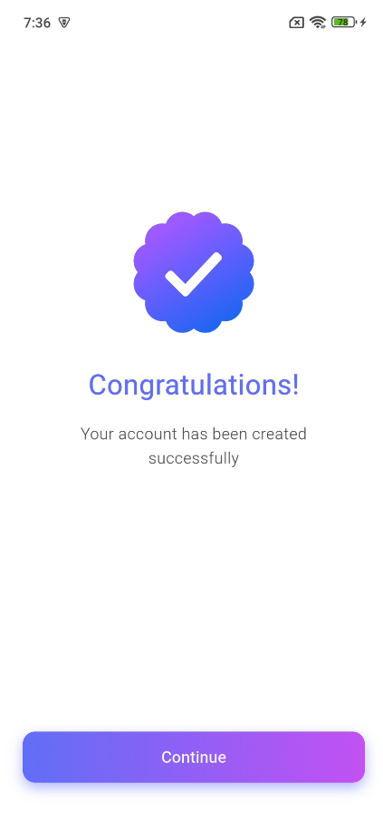
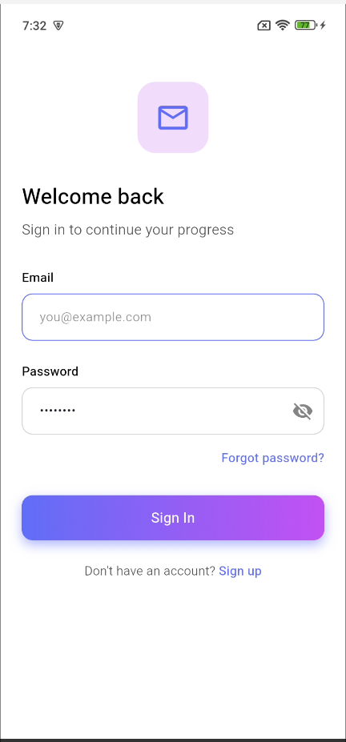
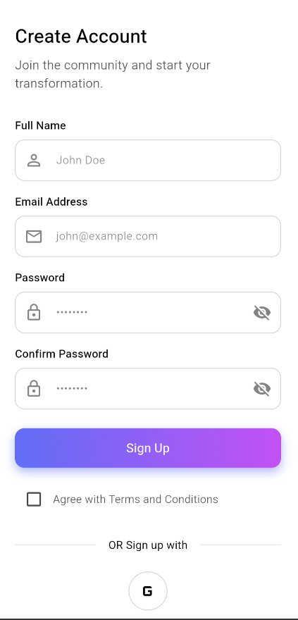
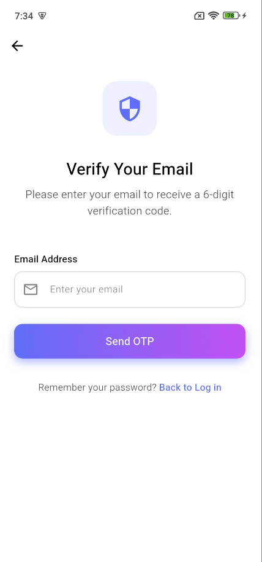
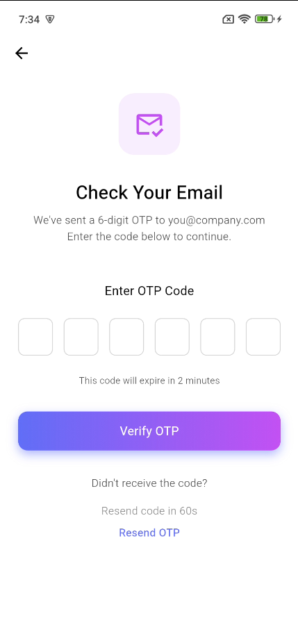

# Orbital Auth Screens

This folder contains a collection of reusable Flutter authentication screens (Dart source files) and example screenshots used in the Orbital-themed UI collection.

## Contents

- [congratulations_screen.dart](https://github.com/Ismail554/My-Flutter-Widgets/blob/main/orbital_auth_screens/congratulations_screen.dart) - A congratulatory / success screen shown after a successful action (e.g., account created).
- [forgot_password_screen.dart](https://github.com/Ismail554/My-Flutter-Widgets/blob/main/orbital_auth_screens/forgot_password_screen.dart) - Screen for requesting a password reset.
- [login_screen.dart](https://github.com/Ismail554/My-Flutter-Widgets/blob/main/orbital_auth_screens/login_screen.dart) - Login screen UI.
- [otp_verification_screen.dart](https://github.com/Ismail554/My-Flutter-Widgets/blob/main/orbital_auth_screens/otp_verification_screen.dart) - One-time-password verification screen.
- [sign_up_screen.dart](https://github.com/Ismail554/My-Flutter-Widgets/blob/main/orbital_auth_screens/sign_up_screen.dart) - Sign up / registration screen UI.

## Screenshots (attached)

Images are included in this folder. They are referenced below so they render on GitHub when viewing this README.

- Congratulations screen:



- Login screen:



- Sign Up screen:



- Verify email screen (example image):



- Verify OTP screen:



## How to use

Import the screen you need into your Flutter project and push it with Navigator or use it inside your routing setup. Example:

```dart
import 'package:your_project/orbital_auth_screens/login_screen.dart';

Navigator.of(context).push(
  MaterialPageRoute(builder: (_) => LoginScreen()),
);
```

Replace `your_project` with your package name or use a relative import if you're using the files directly inside the same project.

## Notes

- These screens are UI-only and do not include backend/auth logic; connect them to your authentication flow or state management (Firebase, REST API, Bloc, Provider, etc.).
- If you'd like the images removed or filenames changed, update the image files in this folder and adjust the references here.

---

If you want, I can also:
- Add example routing in a sample `main.dart`.
- Extract common widgets to a shared `widgets/` file.
- Optimize README with usage badges or a short demo GIF.

Created on 2026-02-03 by GitHub Copilot for user Ismail554.