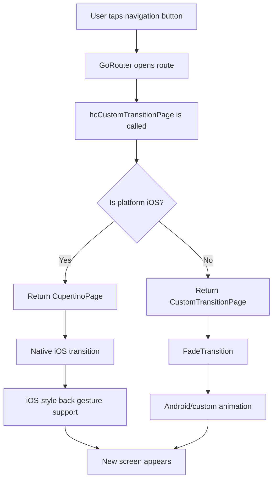
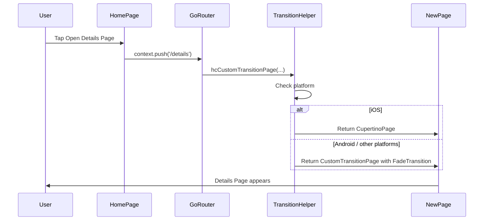
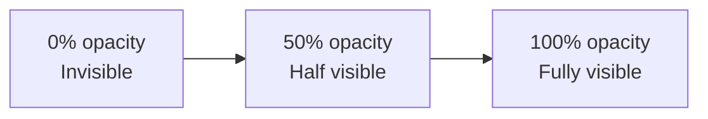

# Platform-Aware Native Page Transitions in Flutter

## Goal

This document explains how to create a clean, platform-aware page transition helper in Flutter using `go_router`.

The target behavior is:

```text
iOS      → use native iOS page transition with CupertinoPage
Android  → use custom fade transition with CustomTransitionPage
```

This helps the app feel natural on each platform while keeping routing code clean and reusable.

---

## 1. The Problem

In Flutter, page navigation can look different depending on how you create routes.

A beginner Flutter developer may write every route like this:

```dart
GoRoute(
  path: '/details',
  builder: (context, state) => const DetailsPage(),
)
```

This works, but it does not give you full control over page transitions.

Sometimes you need:

- Native iOS-style navigation on iPhone
- Custom transition on Android
- Reusable transition logic
- Cleaner route files
- Consistent animation across the app

Without a helper function, you may repeat the same transition code in every route.

---

## 2. The Solution

Create one reusable helper function:

```dart
Page<dynamic> hcCustomTransitionPage({
  required LocalKey key,
  required Widget child,
}) {
  if (defaultTargetPlatform == TargetPlatform.iOS) {
    return CupertinoPage(
      key: key,
      child: child,
    );
  }

  return CustomTransitionPage(
    key: key,
    child: child,
    transitionDuration: const Duration(milliseconds: 300),
    transitionsBuilder: (
      context,
      animation,
      secondaryAnimation,
      child,
    ) {
      return FadeTransition(
        opacity: animation,
        child: child,
      );
    },
  );
}
```

This function decides which page transition to use based on the current platform.

---

## 3. Infographic



---

## 4. Socratic Explanation

### Question 1: Why do we need a custom transition helper?

Because writing transition logic inside every route creates duplicate code.

Instead of repeating this:

```dart
CustomTransitionPage(
  child: SomePage(),
  transitionsBuilder: ...
)
```

in every route, we create one reusable function.

This makes the routing code cleaner and easier to maintain.

---

### Question 2: Why check the platform?

Because iOS and Android users expect different navigation behavior.

On iOS, users expect:

```text
Page slides from right to left
Back gesture works by swiping from the left edge
Navigation feels like a native iPhone app
```

On Android, you may want:

```text
Fade transition
Material-style motion
Custom route animation
```

So the helper checks:

```dart
defaultTargetPlatform == TargetPlatform.iOS
```

If the app is running on iOS, it returns `CupertinoPage`.

Otherwise, it returns `CustomTransitionPage`.

---

### Question 3: Why use `CupertinoPage` for iOS?

Because `CupertinoPage` gives Flutter navigation a native iOS feel.

It supports iOS-style navigation behavior, including the familiar iOS page transition and back gesture.

```dart
return CupertinoPage(
  key: key,
  child: child,
);
```

This is better than forcing a custom fade transition on iOS, because a fade transition may feel less native to iPhone users.

---

### Question 4: Why use `CustomTransitionPage` for Android?

Because `CustomTransitionPage` allows us to define our own animation.

In this example, Android uses a fade animation:

```dart
return FadeTransition(
  opacity: animation,
  child: child,
);
```

The `animation` value goes from `0.0` to `1.0`.

That means:

```text
0.0 → page is invisible
0.5 → page is half visible
1.0 → page is fully visible
```

---

### Question 5: What is the purpose of `key`?

The `key` helps Flutter and GoRouter identify the page correctly.

In GoRouter, you usually pass:

```dart
key: state.pageKey
```

This helps Flutter manage the page stack properly.

---

### Question 6: What is the purpose of `child`?

The `child` is the actual screen you want to display.

Example:

```dart
child: const DetailsPage()
```

The transition function does not care which screen it receives. It only wraps that screen inside the correct page transition.

---

## 5. Required Packages

Add `go_router` to `pubspec.yaml`:

```yaml
dependencies:
  flutter:
    sdk: flutter
  go_router: ^14.0.0
```

Then run:

```bash
flutter pub get
```

Use the latest compatible `go_router` version for your project.

---

## 6. Recommended File Structure

For a beginner-friendly app, organize the files like this:

```text
lib/
├── main.dart
├── app_router.dart
├── transition_page.dart
└── pages/
    ├── home_page.dart
    ├── details_page.dart
    └── profile_page.dart
```

Purpose of each file:

| File | Purpose |
|---|---|
| `main.dart` | App entry point |
| `app_router.dart` | Defines all app routes |
| `transition_page.dart` | Stores reusable transition helper |
| `home_page.dart` | First screen |
| `details_page.dart` | Example second screen |
| `profile_page.dart` | Example third screen |

---

## 7. Transition Helper File

Create this file:

```text
lib/transition_page.dart
```

```dart
import 'package:flutter/cupertino.dart';
import 'package:flutter/foundation.dart';
import 'package:flutter/widgets.dart';
import 'package:go_router/go_router.dart';

Page<dynamic> hcCustomTransitionPage({
  required LocalKey key,
  required Widget child,
}) {
  if (defaultTargetPlatform == TargetPlatform.iOS) {
    return CupertinoPage(
      key: key,
      child: child,
    );
  }

  return CustomTransitionPage(
    key: key,
    child: child,
    transitionDuration: const Duration(milliseconds: 300),
    transitionsBuilder: (
      context,
      animation,
      secondaryAnimation,
      child,
    ) {
      return FadeTransition(
        opacity: animation,
        child: child,
      );
    },
  );
}
```

---

## 8. Demo App Example

This demo app has three screens:

```text
Home Page    → Details Page
Home Page    → Profile Page
Details Page → Back
Profile Page → Back
```

The transition behavior will be:

```text
iOS      → CupertinoPage native transition
Android  → Fade transition
```

---

## 9. main.dart

Create this file:

```text
lib/main.dart
```

```dart
import 'package:flutter/material.dart';

import 'app_router.dart';

void main() {
  runApp(const DemoApp());
}

class DemoApp extends StatelessWidget {
  const DemoApp({super.key});

  @override
  Widget build(BuildContext context) {
    return MaterialApp.router(
      title: 'Platform Transition Demo',
      debugShowCheckedModeBanner: false,
      routerConfig: appRouter,
      theme: ThemeData(
        useMaterial3: true,
        colorSchemeSeed: Colors.blue,
      ),
    );
  }
}
```

---

## 10. app_router.dart

Create this file:

```text
lib/app_router.dart
```

```dart
import 'package:go_router/go_router.dart';

import 'pages/details_page.dart';
import 'pages/home_page.dart';
import 'pages/profile_page.dart';
import 'transition_page.dart';

final GoRouter appRouter = GoRouter(
  initialLocation: '/',
  routes: [
    GoRoute(
      path: '/',
      name: 'home',
      pageBuilder: (context, state) {
        return hcCustomTransitionPage(
          key: state.pageKey,
          child: const HomePage(),
        );
      },
    ),
    GoRoute(
      path: '/details',
      name: 'details',
      pageBuilder: (context, state) {
        return hcCustomTransitionPage(
          key: state.pageKey,
          child: const DetailsPage(),
        );
      },
    ),
    GoRoute(
      path: '/profile',
      name: 'profile',
      pageBuilder: (context, state) {
        return hcCustomTransitionPage(
          key: state.pageKey,
          child: const ProfilePage(),
        );
      },
    ),
  ],
);
```

Important part:

```dart
pageBuilder: (context, state) {
  return hcCustomTransitionPage(
    key: state.pageKey,
    child: const DetailsPage(),
  );
}
```

Use `pageBuilder` instead of `builder` when you want to return a custom `Page`.

---

## 11. home_page.dart

Create this file:

```text
lib/pages/home_page.dart
```

```dart
import 'package:flutter/material.dart';
import 'package:go_router/go_router.dart';

class HomePage extends StatelessWidget {
  const HomePage({super.key});

  @override
  Widget build(BuildContext context) {
    return Scaffold(
      appBar: AppBar(
        title: const Text('Home Page'),
      ),
      body: Center(
        child: Column(
          mainAxisSize: MainAxisSize.min,
          children: [
            const Text(
              'Home Page',
              style: TextStyle(fontSize: 24),
            ),
            const SizedBox(height: 24),
            ElevatedButton(
              onPressed: () {
                context.push('/details');
              },
              child: const Text('Open Details Page'),
            ),
            const SizedBox(height: 12),
            ElevatedButton(
              onPressed: () {
                context.push('/profile');
              },
              child: const Text('Open Profile Page'),
            ),
          ],
        ),
      ),
    );
  }
}
```

---

## 12. details_page.dart

Create this file:

```text
lib/pages/details_page.dart
```

```dart
import 'package:flutter/material.dart';
import 'package:go_router/go_router.dart';

class DetailsPage extends StatelessWidget {
  const DetailsPage({super.key});

  @override
  Widget build(BuildContext context) {
    return Scaffold(
      appBar: AppBar(
        title: const Text('Details Page'),
      ),
      body: Center(
        child: ElevatedButton(
          onPressed: () {
            context.pop();
          },
          child: const Text('Go Back'),
        ),
      ),
    );
  }
}
```

---

## 13. profile_page.dart

Create this file:

```text
lib/pages/profile_page.dart
```

```dart
import 'package:flutter/material.dart';
import 'package:go_router/go_router.dart';

class ProfilePage extends StatelessWidget {
  const ProfilePage({super.key});

  @override
  Widget build(BuildContext context) {
    return Scaffold(
      appBar: AppBar(
        title: const Text('Profile Page'),
      ),
      body: Center(
        child: ElevatedButton(
          onPressed: () {
            context.pop();
          },
          child: const Text('Go Back'),
        ),
      ),
    );
  }
}
```

---

## 14. How the Code Works Step by Step

When the user taps this button:

```dart
context.push('/details');
```

GoRouter searches for this route:

```dart
GoRoute(
  path: '/details',
  pageBuilder: ...
)
```

Then GoRouter calls:

```dart
hcCustomTransitionPage(
  key: state.pageKey,
  child: const DetailsPage(),
)
```

Inside the helper:

```dart
if (defaultTargetPlatform == TargetPlatform.iOS) {
  return CupertinoPage(...);
}
```

If the app is running on iOS, it returns `CupertinoPage`.

Otherwise, it returns:

```dart
CustomTransitionPage(...)
```

Then Flutter animates the new page using:

```dart
FadeTransition(
  opacity: animation,
  child: child,
)
```

---

## 15. Route Flow Infographic



---

## 16. Why `pageBuilder` Instead of `builder`?

GoRouter supports both `builder` and `pageBuilder`.

### `builder`

Use `builder` when you only want to return a widget:

```dart
GoRoute(
  path: '/details',
  builder: (context, state) {
    return const DetailsPage();
  },
)
```

### `pageBuilder`

Use `pageBuilder` when you want to control the `Page` object and transition:

```dart
GoRoute(
  path: '/details',
  pageBuilder: (context, state) {
    return hcCustomTransitionPage(
      key: state.pageKey,
      child: const DetailsPage(),
    );
  },
)
```

For custom transitions, use `pageBuilder`.

---

## 17. Understanding the Animation

This code controls the fade effect:

```dart
FadeTransition(
  opacity: animation,
  child: child,
)
```

The `animation` value changes during navigation:

```text
Start  → 0.0 opacity
Middle → 0.5 opacity
End    → 1.0 opacity
```

So the page gradually appears.



---

## 18. Better Naming Option

The current function name is:

```dart
hcCustomTransitionPage
```

That is acceptable if `hc` is your project prefix.

For a more general reusable name, you can use:

```dart
Page<dynamic> platformTransitionPage({
  required LocalKey key,
  required Widget child,
}) {
  ...
}
```

Example:

```dart
return platformTransitionPage(
  key: state.pageKey,
  child: const DetailsPage(),
);
```

---

## 19. Common Beginner Mistakes

### Mistake 1: Using `builder` instead of `pageBuilder`

This will not let you return `CustomTransitionPage`.

Wrong:

```dart
GoRoute(
  path: '/details',
  builder: (context, state) {
    return hcCustomTransitionPage(
      key: state.pageKey,
      child: const DetailsPage(),
    );
  },
)
```

Correct:

```dart
GoRoute(
  path: '/details',
  pageBuilder: (context, state) {
    return hcCustomTransitionPage(
      key: state.pageKey,
      child: const DetailsPage(),
    );
  },
)
```

---

### Mistake 2: Forgetting imports

Make sure these imports exist:

```dart
import 'package:flutter/cupertino.dart';
import 'package:flutter/foundation.dart';
import 'package:flutter/widgets.dart';
import 'package:go_router/go_router.dart';
```

---

### Mistake 3: Applying Android fade transition to iOS

This may work technically, but the app may not feel native on iPhone.

The helper avoids that by using:

```dart
CupertinoPage(
  key: key,
  child: child,
)
```

on iOS.

---

### Mistake 4: Repeating transition code in every route

Avoid writing `CustomTransitionPage` again and again.

Use one helper function and call it from every route.

---

## 20. Optional: Slide Transition for Android

If you want Android to slide instead of fade, replace `FadeTransition` with `SlideTransition`.

```dart
return SlideTransition(
  position: Tween<Offset>(
    begin: const Offset(1, 0),
    end: Offset.zero,
  ).animate(animation),
  child: child,
);
```

Full Android part:

```dart
return CustomTransitionPage(
  key: key,
  child: child,
  transitionDuration: const Duration(milliseconds: 300),
  transitionsBuilder: (
    context,
    animation,
    secondaryAnimation,
    child,
  ) {
    final offsetAnimation = Tween<Offset>(
      begin: const Offset(1, 0),
      end: Offset.zero,
    ).animate(animation);

    return SlideTransition(
      position: offsetAnimation,
      child: child,
    );
  },
);
```

---

## 21. Optional: Fade + Scale Transition

You can also combine fade and scale.

```dart
return FadeTransition(
  opacity: animation,
  child: ScaleTransition(
    scale: Tween<double>(
      begin: 0.96,
      end: 1.0,
    ).animate(animation),
    child: child,
  ),
);
```

This makes the page fade in while slightly zooming in.

Use this carefully. Too much animation can make the app feel slow or distracting.

---

## 22. Best Practices

Use this approach when:

- The app uses `go_router`
- You want clean route files
- You want platform-aware page behavior
- You want native iOS transition
- You want custom Android animation

Avoid overusing complex animations. Good navigation should feel smooth and predictable.

Recommended duration:

```dart
const Duration(milliseconds: 250)
```

or:

```dart
const Duration(milliseconds: 300)
```

---

## 23. Final Code Summary

The main idea is simple:

```dart
if (iOS) {
  return CupertinoPage();
} else {
  return CustomTransitionPage();
}
```

Complete reusable helper:

```dart
Page<dynamic> hcCustomTransitionPage({
  required LocalKey key,
  required Widget child,
}) {
  if (defaultTargetPlatform == TargetPlatform.iOS) {
    return CupertinoPage(
      key: key,
      child: child,
    );
  }

  return CustomTransitionPage(
    key: key,
    child: child,
    transitionDuration: const Duration(milliseconds: 300),
    transitionsBuilder: (
      context,
      animation,
      secondaryAnimation,
      child,
    ) {
      return FadeTransition(
        opacity: animation,
        child: child,
      );
    },
  );
}
```

---

## 24. Checklist

Before using this in production, check:

```text
[ ] go_router is added in pubspec.yaml
[ ] Transition helper is created in a separate file
[ ] Routes use pageBuilder, not builder
[ ] state.pageKey is passed as key
[ ] iOS uses CupertinoPage
[ ] Android uses CustomTransitionPage
[ ] Animation duration feels natural
[ ] Back navigation works
[ ] iOS swipe-back gesture is tested
[ ] Android transition is tested on a real device
```

---

## 25. Beginner Mental Model

Think of the helper like a small traffic controller:

```text
A page wants to open.
The helper checks the platform.
If the phone is iPhone, it uses iOS navigation style.
If the phone is Android, it uses the custom fade transition.
Then the page opens.
```

That is the entire purpose of the code.
